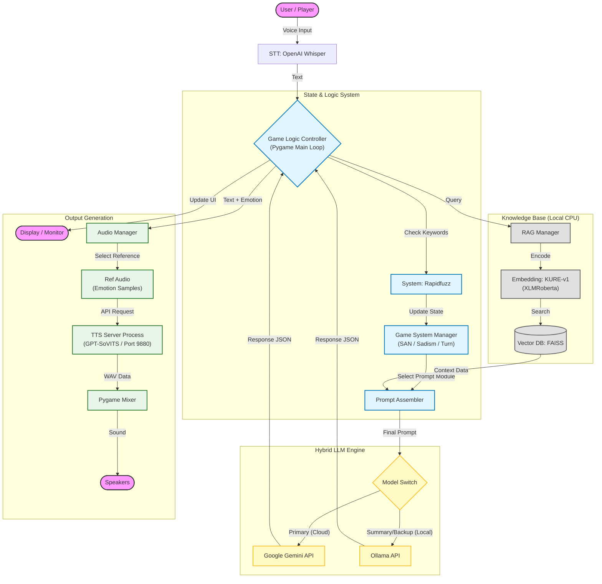
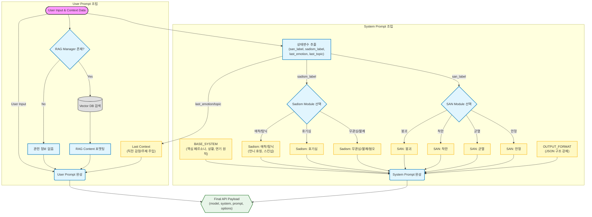
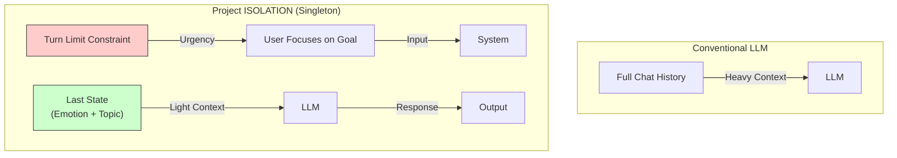

# 👁️ Project: ISOLATION (격리)
> **LLM 기반 심리적 공포 게임 (Psychological Horror Game powered by LLM)**
> *2025 오픈소스 소프트웨어 프로젝트 최종 결과물*

## 📖 프로젝트 개요 (Overview)
**Project: ISOLATION**은 정해진 스크립트 없이, **플레이어의 음성(STT)이나 텍스트 입력에 따라 AI가 실시간으로 반응하며 대화를 진행하는 LLM 기반 인터랙티브 호러 게임**입니다.
본 프로젝트는 '**금칙어 게임(Taboo Game)**'에서 모티프를 얻어 독창적인 게임성을 설계했습니다.
* **플레이어의 제약:** 정신력(SAN) 붕괴를 막기 위해, 스토리에 관련된 **'특정 금칙어' 언급을 스스로 자제**해야 합니다.
* **게임의 목표:** 대화를 유도하여 역으로 **상대(LLM)가 숨겨진 비밀에 관련된 '진실의 키워드'를 스스로 언급하게 만드는 것**이 T(True) 엔딩의 조건입니다.
최신 오픈소스 AI 기술(RAG, Zero-shot TTS, Whisper)과 정교한 **프롬프트 엔지니어링**, 그리고 심혈을 기울인 **World-Building**을 Python 게임 엔진(Pygame)에 통합하여, 단순한 시청각적 공포를 넘어 "**대화의 줄타기에서 오는 심리적 공포**"를 구현하는 데 초점을 맞추었습니다.

---
## 🏗️ 시스템 아키텍처 (System Architecture)


---

## 🧠 핵심 로직 및 알고리즘 (Core Logic & Algorithms)
본 프로젝트는 LLM의 환각을 억제하고, 게임 캐릭터의 입체성을 부여하기 위해 다음과 같은 독자적인 로직을 설계했습니다.
### 1. 이중 축 성격 시스템 (Dual-Axis Personality Engine)
캐릭터의 상태를 단일 변수가 아닌, **두 개의 독립된 축**(Independent Axes)으로 관리하여 입체적이고 일관성 있는 페르소나를 유지합니다.
* **Sadism (가학성):** 캐릭터의 가학적 성향을 제어. (호감도에 대응)
* **SAN (Sanity, 이성):** 캐릭터의 이성을 제어. 더 정확히는 '트라우마로 인한 환각의 선명도'를 제어.
> **Effect:** 두 변수가 서로 독립적으로 작동함으로써, *"이성적이지만 가학적인 상태"* 등 복합적인 캐릭터 표현이 가능합니다.

### 2. 감정 기반 참조 음성 매핑 (Emotion-Adaptive TTS Pipeline)
LLM이 텍스트와 함께 반환한 **감정 태그**(Emotion Tag)를 분석하여, 즉시 해당 감정에 맞는 **'참조 음성**(Reference Audio)'을 GPT-SoVITS에 주입합니다.
* **Logic:** `LLM Output(Text, Emotion)` ➡️ `Audio Mapper` ➡️ `Select Ref Audio` ➡️ `GPT-SoVITS Inference`
* **Scalability:** 현재는 핵심 감정 위주로 동작을 검증한 상태이나, **JSON 설정 파일과 오디오 에셋만 추가하면 코드를 수정하지 않고도 무한히 감정 표현을 확장**할 수 있는 유연한 구조로 설계되었습니다.
> **Effect:** 단순한 텍스트 리딩이 아니라, "**화가 났을 때는 화난 목소리의 톤과 억양**"을 그대로 복제하여 발화합니다.

### 3. 상태 기반 프롬프트 모듈화 (Modular Prompt Injection)
LLM에게 모든 규칙을 한 번에 주입하지 않고, **현재 상태**(State)에 필요한 행동 요령(Instruction)만 선별하여 프롬프트에 주입합니다.
* **Optimization:** 불필요한 토큰 사용을 줄여 응답 속도를 높이고 비용을 절감합니다.
* **Accuracy:** "미친 상태의 규칙"과 "정상 상태의 규칙"이 섞여 LLM이 혼란을 겪는(Attention Bleeding) 현상을 원천 차단했습니다. (극단적인 상태에 주의를 빼앗기는 문제를 방지)


### 4. 싱글턴 액터 & 턴 제약 기반 기억 최적화 (Singleton Memory Optimization)
"**모든 대화를 기억할 필요가 있는가?**"라는 질문에서 출발하여, LLM의 컨텍스트 윈도우 한계를 **게임 디자인**(Game Design)으로 극복했습니다.

* **Problem:** 긴 대화 로그를 모두 프롬프트에 넣으면 비용이 증가하고, 중요하지 않은 정보에 집중하는 'Attention Bleeding'이 발생합니다.
* **Solution:** 모델에게 **전체 대화 기록(Chat History)을 제공하지 않습니다.** 대신, 직전 턴의 '**감정(Emotion)**'과 요약된 **'주제(Topic)'** 단 2가지 변수만 넘겨주어, 마치 기억이 이어지는 듯한 **싱글턴(Singleton) 연기**를 수행하게 합니다.
* **Game Mechanics:** 플레이어에게 '**제한된 턴(Turn Limit)**'을 부여하여, 플레이어가 과거의 대화를 캐묻기보다 당장의 목표(생존/탈출 -> 이를 위한 정보 알아내기)에 집중하도록 유도합니다. 이를 통해 "**장기 기억의 부재"를 게임적 긴장감으로 은폐**하고, 자연스러운 몰입감을 형성합니다.
 *Status: Prototype (Testing efficiency under 20 turns constraint)*

---
## 🚧 한계점 및 향후 계획 (Limitations & Future Works)
현재 프로토타입은 핵심 상호작용(Core Interaction) 검증에 집중되어 있으며, 시나리오 및 데이터 확장은 다음 단계로 계획되어 있습니다.
### 1. 멀티 엔딩 시스템 구현 (Multi-Ending Implementation)
현재는 샌드박스 형태이지만, 향후 **SAN 수치**(이성)와 **호감도**(가학성)의 조합에 따라 4가지의 구체적인 엔딩 분기를 구현할 예정입니다.
* **M (Murder) 엔딩:** 호감도/SAN 최저. 가학성이 아닌 순수한 혐오로 인한 살해 엔딩.
* **N (Normal) 엔딩:** 턴 제한 도달. 시설의 억제력 상실로 인한 폭주 및 살해 엔딩.
* **H (Hidden) 엔딩:** 호감도 최대(가학성 MAX). 과도한 애정으로 인한 끔찍한 결말.
* **T (True) 엔딩:** 특정 키워드를 통한 진실 발견. 유일한 생존 및 탈출 엔딩.
### 2. 기억 소거의 한계 검증
싱글턴(Singleton) 기억 전략이 20턴 이상의 장기 플레이에서도 위화감 없이 작동하는지, 사용자가 몰입을 유지하는 임계점을 테스트할 예정입니다.
### 3. RAG 데이터 확장
현재 약 50개의 핵심 청크로 구성된 **캐릭터 프로필** 및 **세계관 설정** 데이터를 확장하여, 몰입도를 높이고 환각(Hallucination)을 더욱 효과적으로 억제할 계획입니다.


---

## 🛠️ 설치 및 실행 (Installation)

### 1. 사전 요구 사항 (Prerequisites)
* **OS:** Windows 10/11 (Recommended)
* **Python:** 3.10 이상
* **Anaconda:** (GPT-SoVITS 구동용 필수)
* **GPU:** NVIDIA GeForce RTX 3060 이상 권장 (CUDA 지원 필수)
* **C++ Build Tools (필수):** [Visual Studio Build Tools](https://visualstudio.microsoft.com/visual-cpp-build-tools/)
    * 설치 시 **"C++를 사용한 데스크톱 개발"** 항목을 체크해야 합니다.
    * *Note: `jieba_fast`, `pyopenjtalk` 등 음성 처리 의존성 패키지 빌드를 위해 반드시 필요합니다.*

### 2. 프로젝트 설정
``` bash
# 1. 저장소 클론
git clone https://github.com/MimicNight/Project_Isolation.git
cd Project_Isolation

# 2. 게임 구동용 가상환경 생성 및 의존성 설치
python -m venv venv
venv\Scripts\activate
pip install -r requirements.txt

# 3. 환경 변수 설정
# .env.example 파일을 .env로 변경하고 API 키(Google)를 입력하세요.
```

### 3. 모델 및 에셋 배치 (Model Setup)
본 프로젝트는 실행을 위해 대용량 AI 모델이 필요합니다.
#### 1) RAG 데이터 (세계관/캐릭터 설정)
* **Vector DB 및 Embedding Model:** 용량 및 파일 관리 목적으로 GitHub 저장소에는 포함되지 않았습니다. 아래 링크에서 다운로드하여 배치해주세요.
    * **📥 다운로드:** [Google Drive Link (공개)](https://drive.google.com/file/d/1qXvDcouX82xmA8__wtClH0tq1Mjoa-s0/view?usp=sharing)
#### 2) TTS 모델 (GPT-SoVITS)
* **Voice Model:** 학습에 사용된 음성 데이터의 저작권 보호를 위해 **공개 배포하지 않습니다.**
    * **🎓 평가자 안내:** 교수님께는 **이클래스(E-Class) 과제 제출**로 암호화된 모델의 다운로드 링크와 비밀번호를 별도 전달해 드렸습니다. 현 학기가 종료되면, 다운로드 링크는 비활성화 예정입니다.
#### 3) 참조 음성 (Reference Audio)
* **Ref Audio (.mp3):** TTS가 감정을 표현하기 위해 참조하는 원본 음성 파일입니다. 저작권 보호를 위해 **공개 배포하지 않으며**, TTS 모델과 함께 제공됩니다.
    * **📥 다운로드:** 위 **평가자용 비공개 링크**(Google Drive)에 포함되어 있습니다.
    * **📂 배치 경로:** 다운로드한 `.mp3` 파일들을 아래 경로에 넣어주세요.
        * `assets/audio/samples/`
          *(포함 파일: angry.mp3, annoyed.mp3, neutral.mp3, san.mp3)*
> **Note:** 참조 음성이 없으면 오류가 발생할 수 있습니다. 반드시 배치해 주세요.
* **📂 배치 경로:**
    * **RAG Embedding Model:** `assets/models/embedding/KURE-v1-yuhwa-final/`
    * **Vector DB:** `assets/database/vectordb/`
    * **GPT Models:** `assets/GPT-SoVITS-v2-240821/GPT_weights_v2/(파일명).ckpt`
    * **SoVITS Models:** `assets/GPT-SoVITS-v2-240821/SoVITS_weights_v2/(파일명).pth`
#### 📂 폴더 구조 및 배치 방법
본 저장소의 `assets` 폴더 내부에는 모델을 넣을 빈 폴더와 필수 실행 파일(`Run_TTS_Server.bat`)이 미리 준비되어 있습니다.
> **💡 설치 팁 (Windows 기준)**
> 다운로드 받은 **`GPT-SoVITS-v2-240821`** 폴더를 그대로 **`assets`** 폴더 안으로 복사(드래그)해 넣으세요.
> * 윈도우가 **"폴더를 통합(병합)하시겠습니까?"** 라고 물으면 '예'를 누르시면 됩니다.
> * 이렇게 하면 기존에 들어있는 실행 스크립트는 유지되면서, 필요한 모델 파일만 자동으로 채워집니다.

### 4. Local LLM 설정 및 모델 변경 (Ollama)
본 게임은 **Ollama의 클라우드 추론 서비스**를 활용하여, 로컬 GPU 사양과 관계없이 **DeepSeek-V3(671B), Qwen, GPT-OSS** 등 초거대 모델을 구동할 수 있도록 설계되었습니다.
#### 1) Ollama 클라우드 모델 사용 (권장)
Ollama 계정에 로그인하면 할당된 사용 할당량을 사용하여 고사양 모델을 클라우드에서 실행할 수 있습니다. 두 가지 방식으로 로그인할 수 있습니다.
1. **Ollama 설치:** [공식 홈페이지](https://ollama.com/)에서 설치합니다.
2. **계정 연동 (두 가지 방법)**
**방법 A) Windows GUI에서 로그인 (권장)**
- Ollama 애플리케이션을 실행하면 시스템 트레이에 아이콘이 표시됩니다.
- 시스템 트레이 아이콘을 클릭하여 메뉴를 엽니다.
- **"Account"** 또는 **"Settings"** 메뉴에서 ollama.com 계정으로 로그인합니다.
- 로그인 후 자동으로 클라우드 기능이 활성화됩니다.
**방법 B) 터미널에서 로그인**
```bash
ollama signin
```
> *로그인 후 클라우드 모델 실행 시 계정에 할당된 사용 할당량이 자동으로 소비됩니다. 할당량을 초과하면 유료 결제를 통해 계속 사용할 수 있습니다.*
3. **모델 실행 및 연결 확인 (최초 1회 필수):**
   게임 실행 전, **터미널(CLI) 또는 GUI 환경**에서 모델을 한 번 직접 실행하여 초기화를 진행해야 합니다.
   *(이 과정에서 필요한 리소스가 다운로드되거나 클라우드 연결이 활성화됩니다.)*
   * **방법 A) Ollama GUI 사용:** 
     Ollama에서 제공하는 채팅 인터페이스(ChatGPT와 유사한 GUI)를 열고, **`deepseek-v3.1:671b-cloud`** (또는 사용할 모델)을 선택하여 간단한 인사를 나눠보세요.
   * **방법 B) 터미널(CLI) 사용:** 
     ```bash
     ollama run deepseek-v3.1:671b-cloud
     ```
#### 2) 순수 로컬 모델 사용 (오프라인/대체)
클라우드 할당량을 모두 소진했거나 완전한 오프라인 환경을 원할 경우, 일반적인 로컬 모델로 변경하여 실행할 수 있습니다.
1.  **모델 다운로드(예시 모델):**
```bash
ollama pull exaone3.5:7.8b
```
2.  **설정 변경 (`game.py`):**
`game.py` 파일을 열어 모델명을 로컬에 설치된 이름으로 변경하세요.
``` python
# game.py (Line 20~)
class Game:
    def __init__(self):
        # ...
        # [변경 전] (기본값)
        # self.current_model_name = "gemini-3-pro-preview"
        # self.summary_model_name = "deepseek-v3.1:671b-cloud"
        
        # [변경 후] 내 컴퓨터에 설치된 로컬 모델
        self.current_model_name = "exaone3.5:7.8b" 
        self.summary_model_name = "exaone3.5:7.8b"
```
> *Tip: Ollama 라이브러리에 없는 외부 모델(Hugging Face, GGUF 등)도 커스텀하여 사용할 수 있습니다. 상세한 방법은 **Ollama 공식 문서**를 참고해 주십시오.*

### 5. TTS 서버 설정 (GPT-SoVITS)
본 게임의 핵심인 음성 합성을 위해 별도의 Conda 환경 설정이 필요합니다.  
상세한 설정 방법은 아래 문서를 참고해주세요.  
👉 **[GPT-SoVITS 설치 및 세팅 가이드 보러가기](docs/GPT_SoVITS_GUIDE.md)**

### 6. 게임 실행
모든 설정이 완료되면 아래 명령어로 게임을 시작합니다.
```bash
python main.py
```
> **Note:** 게임 실행 시 관리자 권한 요청 팝업이 뜨며, 백그라운드에서 TTS 서버가 자동으로 실행됩니다.

---

## ⚖️ 라이선스 및 크레딧 (License & Credits)
본 프로젝트의 소스 코드는 **MIT License**를 따릅니다. 단, 사용된 외부 에셋 및 라이브러리의 라이선스는 각 원작자의 정책을 따릅니다.
### Open Source Libraries
* **Engine:** [Pygame](https://www.pygame.org/) (LGPL)
* **AI Model:** [GPT-SoVITS](https://github.com/RVC-Boss/GPT-SoVITS) (MIT License)
* **STT:** [OpenAI Whisper](https://github.com/openai/whisper) (MIT License)
* **RAG Vector Engine:** [FAISS](https://github.com/facebookresearch/faiss) (MIT License)
### AI Models & API
* **Embedding:** [KURE-v1](https://huggingface.co/nlpai-lab/KURE-v1) (MIT License)
* **LLM API:** Google Gemini / DeepSeek (Terms of Use Compliant)
* **Local LLM:** [Ollama](https://ollama.com/) (MIT License)
### Assets
* **Font:** Silver.ttf (CC BY 4.0 / Created by Poppy Works)
* **Sound:** Sonniss GDC Audio Bundle (Standard Royalty Free License)
* **Voice Reference:** Internal R&D Dataset (Temporary / Non-commercial)
### Audio System
본 프로젝트는 **LLM 기반의 실시간 대사 생성**과 **감정 표현 TTS** 파이프라인을 검증하기 위한 R&D 프로젝트입니다.
* **Current Status:** 현재 프로토타입에는 연구용 임시 데이터셋 및 오픈소스 모델이 적용되어 있습니다.
* **Future Plan:** 정식 릴리즈 및 상용화 단계에서는 전문 성우 녹음 또는 라이선스가 확보된 상용 AI 보이스로 전면 교체하여, 상용화 가능한 수준의 저작권 기준을 준수할 예정입니다.
---
**Developed by 오픈닭강정 (조강건(조장) / 문정규)**
* 📧 **Contact:** whrkdrjs13@gmail.com (설치 및 실행 관련 문의)
* 🏫 **Course:** Open Source Software (2025)
